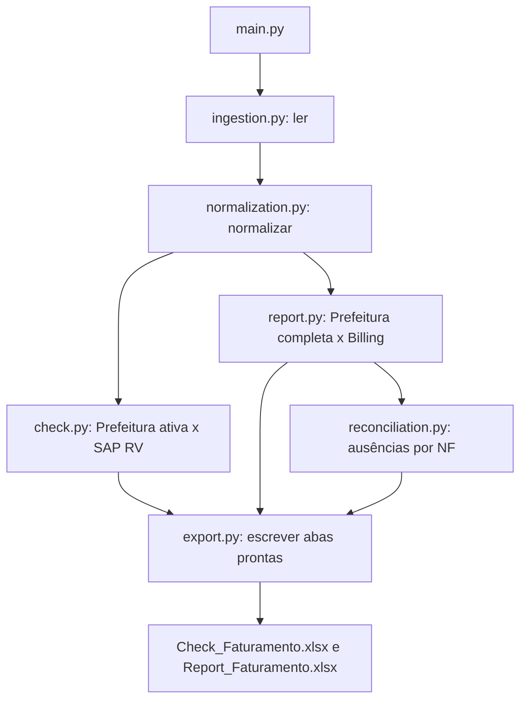

# IA Quarteto

Conciliação fiscal entre Prefeitura, SAP FS10N e Billing ZSD008. O projeto lê
três extratos e gera dois arquivos Excel, com um único comando.

## Arquitetura

```text
main.py                   CLI, orquestração e configuração do log
src/
    ingestion.py          Leitura das três fontes
    normalization.py      Valores, nomes de colunas e identificadores
    reconciliation.py     Ausências de NF entre Prefeitura e Billing
    check.py              Montagem das sete abas do Check
    report.py             Montagem das cinco abas do Report
    export.py             Escrita Excel compartilhada
tests/
    test_rules.py         Casos pequenos que protegem as regras atuais
    test_pipeline.py      Regressão com as entradas reais e teste do CLI
    fixtures/baseline.json  Identidade das entradas e das 12 abas de referência
```



Os módulos de negócio recebem DataFrames e devolvem um dicionário
`nome_da_aba -> DataFrame`. Não leem arquivos, configuram log ou exportam.
A ordem desse dicionário determina a ordem das abas. `build_workbooks`, no
`main.py`, lê cada fonte uma vez e passa os mesmos dados preparados aos builders.

As dependências seguem uma direção: `main` usa os módulos; `report` usa
`reconciliation`; `reconciliation` usa a normalização da chave. `check` e
`export` não dependem do Report. Não há classes de serviço, hierarquia de
exportadores, registro de plugins ou configuração global mutável.

### Onde fazer cada mudança

| Mudança | Local |
| --- | --- |
| Formato ou encoding de uma fonte | `src/ingestion.py` |
| Conversão de valores ou identificadores | `src/normalization.py` |
| Critério de ausência entre Prefeitura e Billing | `src/reconciliation.py` |
| Seleção de RV, EF, DG ou abas do Check | `src/check.py` |
| Colunas, segmentos ou abas do Billing | `src/report.py` |
| Formatação ou formato de exportação | `src/export.py` |
| Argumentos, caminhos ou execução | `main.py` |

Uma nova fonte pode acrescentar uma função de leitura e uma de normalização.
Uma regra nova fica no módulo de negócio correspondente. Um módulo só deve ser
dividido quando passar a reunir responsabilidades diferentes; uma nova função
não exige um arquivo novo.

## Fontes

| Fonte | Formato | Uso |
| --- | --- | --- |
| Prefeitura | CSV, separador `;`, UTF-8/Latin-1/CP1252 | NF, cliente, valor e situação |
| FS10N | Excel | Referência, tipo de documento e montante SAP |
| ZSD008 | Excel | Billing: NF, cliente, serviço, fatura e valor bruto |

`NF Billing`, `Valor Billing` e `Saldo Billing` vêm da ZSD008.
Os identificadores do CSV são lidos como texto para preservar zeros à esquerda.
A FS10N mantém sua leitura original: primeira linha como cabeçalho separado.

## Regras preservadas

**Check:** usa as NFs da Prefeitura cuja situação, em maiúsculas, é `SIM`.
Seleciona RV da FS10N por referência exata após remover espaços externos.
Referências compostas não são interpretadas como uma NF neste fluxo.
`Saldo SAP` é o valor absoluto da soma desses RV, e não o saldo completo da
FS10N nem a soma dos valores absolutos de todas as linhas.

**Report:** usa o Billing completo e a Prefeitura completa, incluindo canceladas.
A chave de comparação remove espaços e o sufixo `.0`. Chaves `""`, `nan`,
`none` e `0` são excluídas do cruzamento. Cada fonte é agrupada por NF antes da
comparação, somando seus valores. Os totais gerais continuam usando as linhas
originais, conforme o comportamento anterior.

`Nao_Conciliadas` contém somente NFs presentes em uma das fontes:

- `PREFEITURA_SEM_BILLING`: diferença positiva, igual ao valor da Prefeitura.
- `BILLING_SEM_PREFEITURA`: diferença negativa, igual ao oposto do valor Billing.

Uma NF presente nas duas fontes não entra nessa aba por diferença de valor ou
cancelamento. A igualdade de número não prova igualdade de valor ou situação
fiscal. Essas melhorias exigem uma alteração de regra e testes próprios.

A normalização monetária atual transforma valores não conversíveis em zero.
Linhas SAP repetidas são mantidas. Não há associação automática de estorno por
cliente, semelhança de valor ou trecho de referência.

## Relatórios

| Check_Faturamento.xlsx | Report_Faturamento.xlsx |
| --- | --- |
| SAP x Prefeitura | SAP x Prefeitura |
| Prefeitura Emitidas | Notas Emitidas |
| Notas Emitidas Razao | Nao_Conciliadas |
| Estornadas Razao | Setup |
| Prefeitura Canceladas | Contratos Cielo |
| Cancelamentos | |
| Excecoes | |

`Setup` seleciona descrições que contêm `SETUP`; `Contratos Cielo` seleciona
razões sociais que contêm `CIELO`, sem diferenciar maiúsculas e minúsculas.

## Instalação e execução

Python 3.11 ou superior. As dependências estão fixadas nas versões usadas para
validar esta refatoração. Não é necessário instalar um framework de testes.

```powershell
python -m venv .venv
.\.venv\Scripts\python.exe -m pip install -r requirements.txt
```

O CLI original continua válido:

```powershell
python main.py --prefeitura data/raw/prefeitura/469741B2AESET2026.csv --fs10n data/raw/fs10n/fs10n.xlsx --zsd008 data/raw/zsd008/ZSD008.XLSX
```

Por padrão, os relatórios são escritos em `data/output` e o log em
`logs/reconciliation.log`. Uma execução normal substitui arquivos de saída com
os mesmos nomes. Para preservar históricos, escolha outra pasta:

```powershell
python main.py --prefeitura data/raw/prefeitura/469741B2AESET2026.csv --fs10n data/raw/fs10n/fs10n.xlsx --zsd008 data/raw/zsd008/ZSD008.XLSX --output-dir data/output/novo_fechamento
```

Para conferir os dados sem escrever Excel ou log em arquivo:

```powershell
python main.py --prefeitura data/raw/prefeitura/469741B2AESET2026.csv --fs10n data/raw/fs10n/fs10n.xlsx --zsd008 data/raw/zsd008/ZSD008.XLSX --analisar
```

O diagnóstico apresenta saldos, quantidade de linhas por aba, ausências por
origem, as 20 maiores ausências por valor absoluto e os 20 maiores grupos do
Billing por cliente, descrição, período e fatura. Ele usa as mesmas abas do
fluxo principal; não cria uma segunda implementação das regras.

## Referência e testes

```powershell
python -m unittest discover -s tests -v
```

A referência foi obtida com as regras do commit `efce495` e as três entradas
reais atuais, antes da reorganização. O manifesto registra SHA-256 das fontes,
quantidades, colunas, tipos e hashes de todos os valores/índices das 12 abas,
tanto em memória quanto após exportar e reler Excel. Não compara estilos,
metadados ou bytes dos arquivos Excel.

Os testes de regressão exigem os arquivos atuais de `data/raw` com os mesmos
hashes. Uma troca de entradas deve resultar em uma referência nova, revisada,
sem atualizar a referência antiga apenas para fazer o teste passar.
Os testes pequenos também cobrem agregação de múltiplas linhas, fontes vazias,
chaves inválidas, zeros à esquerda, cancelamentos, diferença de valor nas NFs
comuns, RV por referência exata e preservação de duplicatas SAP.

Os Excel históricos de `data/output` foram preservados. Eles usam populações
diferentes das entradas atuais e não são a referência desta refatoração.
A diferença global entre as fontes exige confirmar período, empresa, conta e
produto antes de concluir sobre ausência fiscal ou contábil.

## Migração dos arquivos antigos

Os leitores viraram funções em `ingestion.py`; normalização ficou em
`normalization.py`; montagem e seleção das abas foram consolidadas em `check.py`
e `report.py`; os exportadores foram unidos em `export.py`. Caminhos e logging
passaram para o CLI. `Readme.txt` foi incorporado a este documento.

Os antigos comandos `python -m src.tools.run_*` foram retirados. Exportação e
resumos usam o CLI acima. Saídas exploratórias completas, busca de substituições
e matching experimental de cancelamentos não são interfaces preservadas nesta
migração; o código anterior continua disponível no histórico Git (`efce495`).
Não foram transferidas suas heurísticas para o fechamento atual.

Caches de Python saíram do versionamento; `.gitignore` cobre ambiente virtual,
caches, logs e saídas novas. Arquivos históricos já rastreados continuam no Git.

Próximas mudanças de negócio podem tratar canceladas no Billing, comparação de
valores com tolerância e contrapartidas DG/RV. Cada uma deve ter critérios
explícitos e testes separados da reorganização estrutural.
